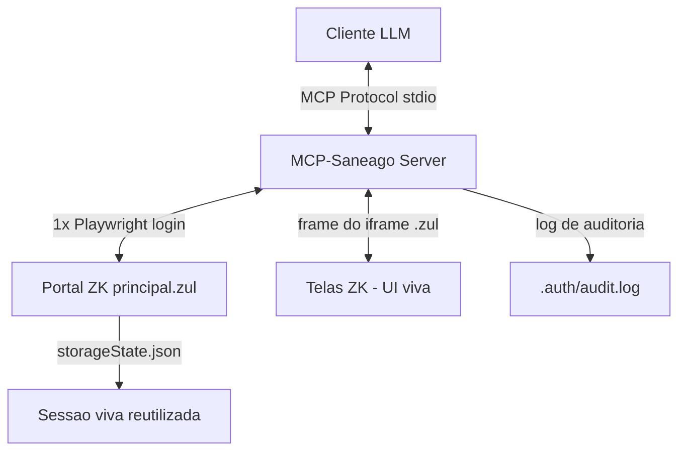

# Plano de Implementação: MCP-Saneago

Servidor **Model Context Protocol (MCP)** que conecta um cliente LLM (Claude Desktop, Cursor, Antigravity/Gemini) ao portal ZK da Intranet Saneago, permitindo **descobrir** aplicações e **operar** telas de forma autenticada, auditável e dentro do perfil de acesso do usuário.

> **Nota de fundamento:** este plano foi revisado com base no que **já está validado** nos projetos `6060-check` (automação ZK do ECO701 que funciona), `PORTAL_LEGADO` (bootstrap de sessão) e na base de conhecimento `SANEAGO ZKAU`. As decisões técnicas abaixo seguem esses aprendizados; onde o plano original divergia, há uma nota `⚠️ Lição aprendida`.

---

## 0. Princípios inegociáveis

1. **Interação por UI viva, não replay de `/zkau`.** As telas ZK guardam estado no servidor amarrado ao desktop/`dtid`. Reconstruir `cmd_0`/`data_0`/`uuid` na mão é frágil e quebra a cada mudança de tela. Dirigimos a UI com Playwright vivo. *(Confirmado em `ANATOMIA_ZKAU.md` e no `co701_discover.js`.)*
2. **Read-only primeiro.** Ferramentas de leitura (listar, inspecionar, consultar) antes de qualquer ação de escrita. Escrita só com confirmação explícita e log de auditoria.
3. **Sempre dentro do perfil autorizado.** Nada de manipular parâmetros para acessar dados fora do escopo do usuário logado. Nunca suprimir logs/auditoria.
4. **Âncoras por rótulo, não por ID.** IDs e UUIDs ZK são dinâmicos e morrem entre sessões. Localizamos campos pelo texto/rótulo próximo (padrão já usado no ECO701).
5. **Segredos fora do Git.** `.auth/` e credenciais sempre em `.gitignore`.

---

## 1. Arquitetura Geral

O servidor MCP mantém **uma sessão de navegador viva por conexão** e traduz chamadas MCP em interações reais de UI.



### Tecnologias
* **Runtime:** Node.js (JavaScript).
* **Protocolo:** `@modelcontextprotocol/sdk` (transporte stdio).
* **Navegação:** Playwright (contexto persistente vivo por sessão). Sem flags de stealth — o login headless simples já funciona no ECO701; anti-detecção só se comprovadamente necessário.
* **Parsing:** avaliação de DOM dentro do `frame` do iframe via `frame.evaluate()` (padrão do `6060-check`), não parser HTTP estático.

⚠️ **Lição aprendida:** o plano original citava "bypass Cloudflare/WAF" e "HTTP RequestContext". Para telas ZK isso não se aplica — a tela abre num `iframe` e o estado é server-side. Mantemos o browser vivo.

---

## 2. Estrutura do Projeto

```text
MCP-Saneago/
├── .auth/                      # storageState.json + audit.log (git-ignored)
├── config/
│   ├── credentials.example.json
│   └── catalogo_aplicacoes.json # catálogo CURADO (crawler só auxilia)
├── src/
│   ├── index.js                # servidor MCP + registro de tools
│   ├── session.js              # login ZK + sessão viva reutilizável
│   ├── portal.js               # abrir app por busca + achar o frame do iframe
│   ├── inspector.js            # lista campos interativos do frame (por rótulo)
│   ├── executor.js             # preencher/clicar via UI viva + waitForResponse
│   ├── audit.js                # log de toda ação de escrita
│   └── tools/
│       └── eco701.js           # 1ª vertical concreta (consulta de RA)
├── tests/                      # testes offline (parsers, montagem de payload)
├── package.json
├── .gitignore
└── PLAN.md
```

---

## 3. Etapas de Desenvolvimento

### Etapa 1 — Sessão viva (base)
Reaproveitar **apenas o bootstrap de sessão** do `PORTAL_LEGADO/src/session.js` (login headless + `storageState`). ⚠️ **Lição aprendida:** o `PORTAL_LEGADO` autentica no **SanVAWeb** (terminal legado, comandos `PFxx`) — sistema diferente. Só o esqueleto de login/cookies é reutilizável; a lógica de comando dele não serve ao ZK.

1. Abrir `https://www.saneago.com.br/prt/mpt/principal.zul` (headless, `pt-BR`, `America/Sao_Paulo`).
2. Preencher usuário/senha (seletores tolerantes, como no `co701_discover.js`).
3. Salvar `.auth/storage-state.json`.
4. **Manter o contexto Playwright vivo** e reutilizá-lo entre chamadas (pool com timeout de inatividade). Detecção de sessão expirada → refazer login.

**Critério de aceite:** `node -e` que loga e imprime que a sessão está ativa, sem reabrir browser na 2ª chamada.

### Etapa 2 — Abrir aplicação e achar o frame (`portal.js`)
⚠️ **Lição aprendida:** não há navegação por URL do `.zul`. A tela abre digitando o nome no campo de busca de aplicação e clicando na opção; ela carrega dentro de `iframe[src*="...zul"]`.

1. Ir para `principal.zul` (reusar sessão viva).
2. Digitar o **nome de exibição** do app (ex.: `ECO701 - REGISTRO DE ATENDIMENTO`) e selecionar a opção.
3. Esperar o `iframe` e retornar o objeto `frame` correspondente (loop de `page.frames()` como no `6060-check`).

**Critério de aceite:** função `abrirApp(nomeExibicao) → frame`.

### Etapa 3 — Inspetor de tela (`inspector.js`)
1. Receber o `frame` já aberto.
2. Via `frame.evaluate()`, listar apenas elementos interativos **visíveis** (`input`, `textarea`, `button`, combobox, datebox).
3. Para cada um, devolver: rótulo próximo (texto), tipo, valor atual e um seletor por âncora de rótulo — **não** UUID.
4. Retornar JSON limpo para a LLM.

**Critério de aceite:** dado o frame do ECO701, listar o campo "Número do RA" e o botão "Consultar" com âncoras estáveis.

### Etapa 4 — Executor por UI viva (`executor.js`)
⚠️ **Lição aprendida:** substitui completamente a proposta original de montar POST `/zkau` na mão.

1. `preencher(frame, ancoraRotulo, valor)` → localiza pelo rótulo e `.fill()`.
2. `clicar(frame, ancoraRotulo)` → `.click()`, com `page.waitForResponse(/zkau/)` para saber quando o servidor respondeu.
3. Extrair da tela **apenas** o resultado permitido ao usuário (texto do frame + inputs preenchidos).
4. Toda ação que **altera dados** passa por `audit.js` e exige confirmação (ver Etapa 6).

**Critério de aceite:** consultar uma RA no ECO701 e devolver os campos, sem nenhum POST `/zkau` montado manualmente.

### Etapa 5 — Catálogo de aplicações (`config/catalogo_aplicacoes.json`)
Catálogo **curado e versionado**, não crawler-only (a árvore de menu ZK é lazy-load e frágil).

1. Opcional: crawler gera um rascunho dos nomes de app disponíveis.
2. Curar à mão os apps realmente usados: `{ nome_exibicao, descricao, read_only|escrita, campos_conhecidos }`.
3. Este arquivo alimenta a tool `saneago_listar_aplicacoes`.

### Etapa 6 — Ferramentas MCP (`src/index.js`)
Registrar em ordem de risco crescente:

**Read-only (fase 1):**
1. `saneago_listar_aplicacoes` — devolve o catálogo curado.
2. `saneago_inspecionar_tela` — abre um app e descreve seus campos.
3. `saneago_eco701_consultar_ra` — **vertical concreta**: consulta uma RA e devolve os dados (envelopa o fluxo do `co701_discover.js`).

**Escrita (fase 2, só depois da fase 1 sólida):**
4. `saneago_preencher_campo` — altera valor de um input.
5. `saneago_clicar_botao` — dispara ação.

Toda tool de escrita: (a) descreve o que fará e pede confirmação; (b) registra `audit.log` com timestamp, app, campos e resultado; (c) nunca opera fora do perfil autorizado.

---

## 4. Segurança e auditoria

- Separação clara **read-only vs escrita**; escrita desabilitada por padrão via flag de config.
- `audit.js` grava toda ação de escrita em `.auth/audit.log` (não versionado).
- Nunca registrar cookies, senhas ou tokens em documento/log.
- Respeitar os limites de `SANEAGO ZKAU/ANATOMIA_ZKAU.md`: sem login em massa, sem cookies de terceiros, sem burlar validação de autorização, sem suprimir auditoria.

---

## 5. Ordem de execução (menor risco → maior)

1. Etapa 1 (sessão viva) + teste de reuso de sessão.
2. Etapa 2 + Etapa 3 aplicadas **só ao ECO701**.
3. Etapa 6 fase 1, tool `saneago_eco701_consultar_ra` — **prova o encanamento MCP ponta a ponta**.
4. Generalizar inspector/executor para outros apps do catálogo.
5. Etapa 6 fase 2 (escrita) com confirmação + auditoria.

---

## 6. Próximos passos imediatos
1. `npm init` + instalar `@modelcontextprotocol/sdk` e `playwright`.
2. `.gitignore` protegendo `.auth/` e `config/credentials.json`.
3. Implementar Etapa 1 e provar reuso de sessão viva antes de seguir.
